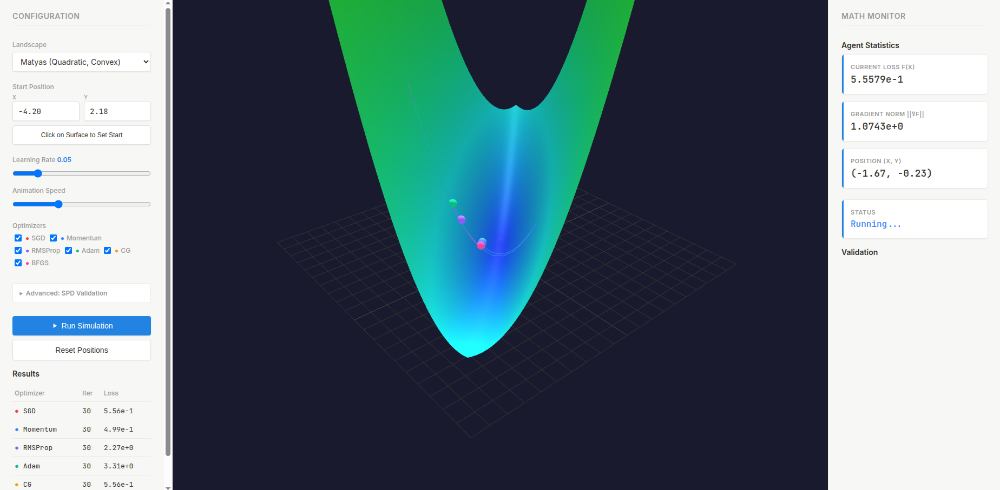

# ENSA Convergeur

**Interactive Optimization Algorithm Visualizer**

[](https://aboulaakoul-elwalid.github.io/convex_optimisation/)

## [Launch Demo](https://aboulaakoul-elwalid.github.io/convex_optimisation/)

A client-side 3D visualization tool for comparing optimization algorithms on various objective function landscapes.

## Features

- **10 Landscape Functions**: Matyas, Himmelblau, Rosenbrock, Rastrigin, Ackley, Beale, Booth, Three-Hump Camel, Lévi N.13, Custom Quadratic
- **6 Optimizers**: SGD, Momentum, RMSProp, Adam, Conjugate Gradient, BFGS
- **Interactive 3D Surface**: Click to set start position, rotate/zoom with mouse
- **Real-time Monitoring**: Loss, gradient norm, position tracking
- **SPD Validation**: Eigenvalue analysis for custom quadratic functions
- **No Backend Required**: Runs entirely in the browser

## Usage

Simply open the [live demo](https://aboulaakoul-elwalid.github.io/convex_optimisation/) or run locally:

```bash
python -m http.server 8000
```

Then visit `http://localhost:8000`

## Tech Stack

- Three.js (3D rendering)
- Vanilla JavaScript (ES Modules)
- No dependencies or build step required
